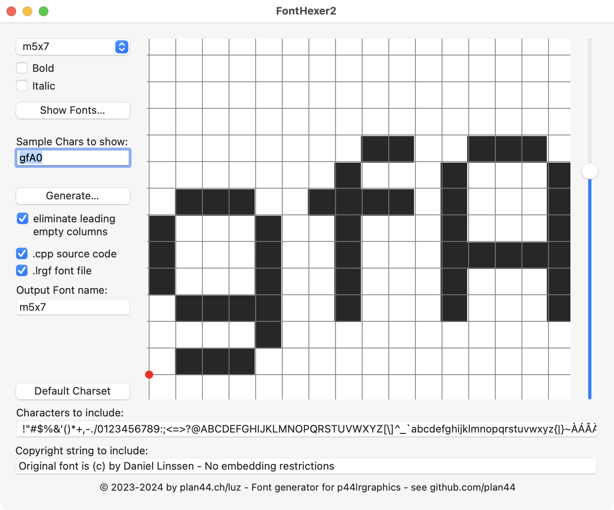

# FontHexer2

FontHexer2 is a simple macOS app for converting fonts into "hex" (binary one-bit-per-pixel) representations for use in embedded devices with low-res pixel displays such as SmartLED (WS281x) chains.

This works best for fonts that were originally designed for low resolutions, like retro fonts taken or inspired from old computers and terminals.

The current version of the app can export the fonts in two formats:
- as .lrgf font files, which is the TLV binary format for loading fonts into [p44lrgraphics](https://github.com/plan44/p44lrgraphics) based projects (for example on a [P44-LC-X](https://plan44.ch/automation/p44-lc-x.php), you can use the `loadfont()` function in your p44scripts).
- as C++ source files suitable for embedding in projects using [p44lrgraphics](https://github.com/plan44/p44lrgraphics) `TextView`, like [vdcd](https://github.com/plan44/vdcd).

The fonts can be of any height up to 64pixels max, and support variable character widths.

The app structure is such that adding other export formats would be simple; the sampling process is completely separated from the export (which is in the `P44FontGenerator` class)

## Usage

- select a font using the popup or the font panel (sometimes flakey)
- use the size slider at the right to fit the grid on the first character (you can set different chars for preview).
- Drag the grid and place the red origin point at the bottom left corner (including descenders)
- possibly modify the character set in the long line at the bottom, these are the characters that will be included in the output. Standard is ASCII 0x20..0x7E plus a few Central European accented characters.
- possibly modify the font name for the output
- possibly add a copyright string to be contained in the output
- select the output format(s)
- press "Generate...", select where to generate the output file(s) (Note: takes several seconds due to not-at-all-speed-optimized implementation)
- To embed in a p44lrgraphics project, put the output file into the `p44lrgraphics/fonts` folder and make sure they get compiled (add font.cpp to Makefile).
- To load at runtime in a P44-xx environment, use the `loadfont()` function.

## How this app came to be

The p44lgraphics export part is fully hand-coded C++, most of it adapted from existing code in `p44lgraphics/fonts.cpp`.

However the mac app itself is primarily the result of a conversation with ChatGPT 3.5. I have a firm understanding of the Cocoa concepts, but my practice is very dated and mostly iOS focused, so for every little UI detail I would have needed to research APIs and howtos. Asking the AI chatbot made this much easier - the suggested code usually worked out of the box. Only finetuning turned out to be more efficient to do manually (or leave for later, like proper fontpanel functioning) - the more detailed and specific my prompt was, the more the AI tended to hallucinate the APIs that *would* fit my needs - but don't exist.

---

(c) 2023-2024 by luz/plan44.ch
